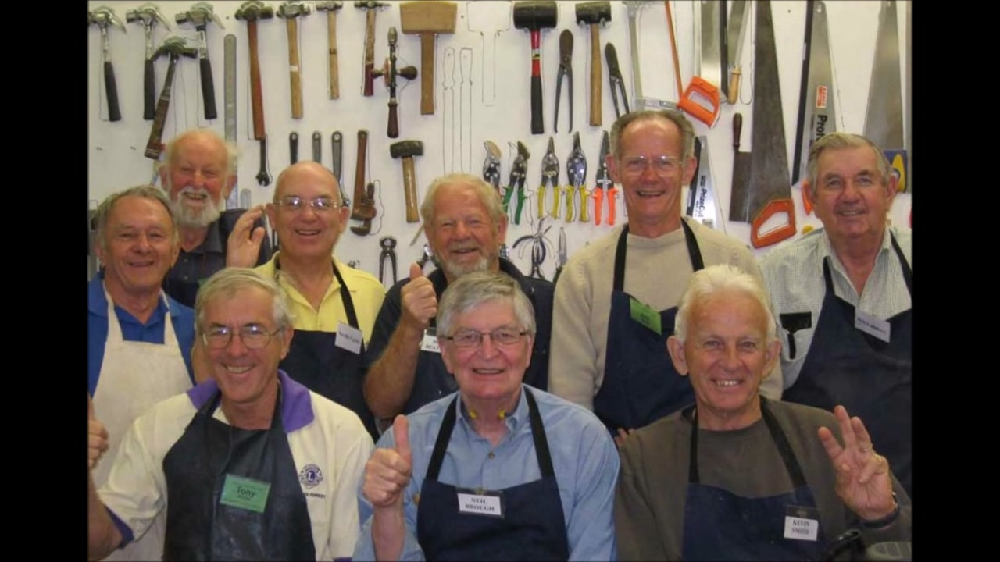

[View on GitHub Pages](https://subsume.github.io/USMSA/)

[Find a Shed](locations.html)

<ul>
  
    <li>
      <a href="{{ post.url }}">{{ post.title }}</a>
    </li>
  
</ul>

# Improving Mental Health for All Men

<iframe src="//www.youtube.com/embed/1tWtY5x24VU?wmode=opaque" frameborder="0" allowfullscreen></iframe>
		
Men’s Sheds offer a place with tools and a pot of coffee, where men can get together, work on projects, talk together and in the process make friends.  It’s a fun, friendly and interesting place to be.    Because **men don’t talk face to face, they talk _Shoulder to Shoulder_**, we’ve made that the Men’s Shed motto.

# Helping Men of All Ages World-Wide

<iframe src="//www.youtube.com/embed/k5AuNf_eeak?wmode=opaque" frameborder="0" allowfullscreen></iframe>

The first Men’s Shed was formed in Australia 20 years ago.  That  first initiative has morphed into some 2000 Men’s Sheds worldwide.  Now the US Men’s Shed Association has been formed in America.  We now have local Men’s Shed in Hawaii, Minnesota and Michigan, and our goal is to help 200 more Men’s Sheds get started in the US within the next five years.

# Impacting Their Local Communities

<iframe src="//www.youtube.com/embed/2PftugQNkPQ?wmode=opaque" frameborder="0" allowfullscreen></iframe>

Men's Shed members and Sheds are impacting communities all over the world. They can provide valuable service to the communities they are located in and act as a good mental health resource right there locally.

You can find information on how to start your own Men's Shed in our "Start a Men's Shed" tab above.

# Supported By Sponsors, Contributors and Partners

<iframe src="//www.youtube.com/embed/qJ6I_gwJx9M?wmode=opaque" frameborder="0" allowfullscreen></iframe>

Men's Shed movement is recognized and supported by charities and non-profit organizations all over the world. The International Rotary, which produced this video on "Doing Good in Australia," has been a long term  sponsor of the Men's Shed Movement. Our Sponsors provide supporting services and funding at national and local levels.

If you belong to an organization that would like to support the Men's Shed movement here in the US, please contact us. If you would like to get more information, or examples, of the impact of Men's Shed, please look through the Resources tab or contact us directly through our contact information.

