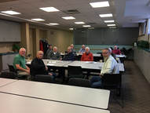
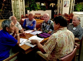
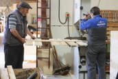
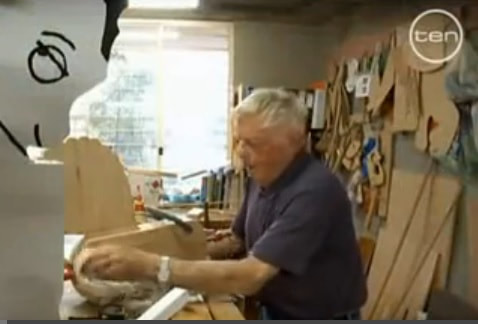
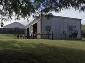

# Two Approaches

## Sponsorship-Approach
This approach is used when a new Men’s Sheds is started by an existing organization, such as a community center, an apartment complex, a communities senior services, a health and wellness organization, a club or other organization. This existing organization forms a Men’s Shed that will meet on their premises and be a sponsored activity, at least to begin with. This allows the Shed to begin holding meetings and activities right away with no startup expenses.

## Stand-Alone
This approach follows the five steps listed below.  It is suggested that after your informational meeting is successful and you begin to form a working group, locating a venue for your shed, should be one of the top three items you consider.  The other two items may be creating an entity and forming a board of directors.  This is the process being used in the Honolulu Men’s Shed and the Travers City Men’s Shed here in the US.

# Sponsoring a New Men's Shed by an Existing Organization
## Use the Sponsorship-Approach when you are in an existing group that wants to add a Men's Shed.

In the Sponsorship-Approach, someone in a group may have heard or read about the Men’s Shed Movement, or someone from outside their group may have approached their organization asking to help start a Men’s Shed. The Organizer can start by contacting people already in their organization, or contact others in their community who could benefit from a Men's Shed.

1. **Learn more about Men’s Sheds in the USA**. A good place for people interested in starting a Men’s Shed to begin is to visit Men’s Sheds web sites, such as the US Men’s Sheds Association’s (USMSA) website you are currently on. You can also learn more about the world-wide Men's Shed Movement at the International Men’s Shed Organization's website at [imso.org](http://imso.org).  Other good sources of information are listed in the Resources link on this website.  You can also contact the US Men’s Sheds Association by email (at <info@usmenssheds.org>) with any questions you might have, or call one of the Board of Directors Members, who are listed on the USMSA website.
2. **Hold an Informational Meeting**  To test the level of interest among local men in getting involved in a Shed, you’ll want to hold an Informational Meeting where everyone is welcome. Someone from your Working Group or from the USMSA (by teleconference) will make a brief presentation about what the Men’s Shed Movement is and how a Men’s Shed could benefit the mental health of local men and benefit the community. You can then discuss ideas about what type of activities may be of interest to local men, what location, days and times would be good for the men, who will be on a Working Group that gets things going, and decide on a name for the new Men’s Shed. In many cases, the Shed will use the community's name, such as the Honolulu Men’s Shed or the Hopkins Men’s Shed.
3. **Form your Men's Shed Working Group**  Talk to the 2, 3 or more of the most interested individuals that attended the Informational Meeting. Typically, these are informal gatherings in your Sponsors location where you can discuss the benefits of Men’s Sheds to local men and start discussing how your Men’s Shed could operate, such as where the Shed is to be located, the days and times for initial meetings. Once this is decided, you can schedule and promote the first meeting of your Men's Shed. It’s very important for everyone to feel invested in the mission of the Men's Shed and your plans.
4. **Registering Your Men’s Shed**  Next, you can go online to download a brief membership form. Fill out the form with the information the Working Group has decided on and return it to USMSA.

## Examples of US Men’s Sheds using the Sponsorship–Approach
Examples of the Sponsorship-Approach can be seen in the Hopkins Men’s Shed in Minnesota and the Platteville Men’s Shed in Wisconsin. In both cases, local city activity centers decided to add Men’s Sheds groups as another activity available for their existing and new Members.  If you have questions, contact us at the USMSA.

#Starting a Stand-alone Men's Shed

## Hold an Informational Meeting

To test the level of interest among local men in getting involved in a Shed, organizing an information meeting is a good way to start. You can do this by first talking to a few friends or local people you know will be interested in helping you get started. Once they’re on board you can start organizing the information meeting.

## Form a Working Group

Hopefully your information evening has been successful.  Out of that meeting you have 2 to 5 people who would be interested in helping you begin a shed.  You now have a working group.  Don’t rush.  Spend time with your group zeroing in on what your visions are for the shed.  It’s very important for everyone to feel invested in the mission.  Do the research from Australia, Ireland, Canada, United Kingdom, Wales and the US and anywhere else sheds are located. Talk to members of the USMSA.

## Visit Other Sheds

This can be done two ways.  By actually visiting sheds or by going on-line.  There are sheds all over the world including the US.  Check them out.  Ask questions, talk to people who run them.

## Managing / Planning / Registering

This section talks about steps in creating a Men's Shed.  For specifics on topics that have been presented here, please contact one of the board members of the USMSA if you have questions.  We have done it before.

There are two items to take care of first.  It is good to undertake these steps around the same time but in order.

1. Pick an official name for your shed.  Then contact the Office of Secretary of State in your state.  Apply for a non-profit entity with the name you chose, such as an association.  They will get back to you in short order.  I cannot speak concerning every state, it usually takes from a few days to about a week. You must have your official name prior to undertaking the second step.
2. Subsequent to your secretary of state approving your shed as a non-profit entity, it's now time to contact the IRS for an EIN.  Employer Identification Number.  This can be done with them over the phone usually and only takes a few minutes.

Once these steps have been completed it is now time to apply for your 501(c)3 Non-Profit Status.  This will allow you to receive funding from the USMSA or other funders to build and maintain your shed going forward and for creating programs.  The first step here is to go to the IRS website.  Look up 1023 or 1023 ez forms.  The USMSA filled out the 1023 ez form.  This is a few pages rather than 20 plus.  The form you fill out is up to you on this.

## Find a Suitable Premises

Once you have completed the other steps, you are ready to identify a venue for your shed.  This can be done in different ways.  You can locate vacant buildings or vacant spaces within buildings.  Glenn Sears found Hawaii’s first location by talking with his state senator.  Phil Johnson has his shed in Minnesota within a larger non-profit, the Hopkins Activity Center.  They had the space available and were very welcoming.  They’re a myriad of ways to locate space.  If you have questions, contact us at the USMSA.

# Starting a Men's Shed Under the Auspices of Another Organization
